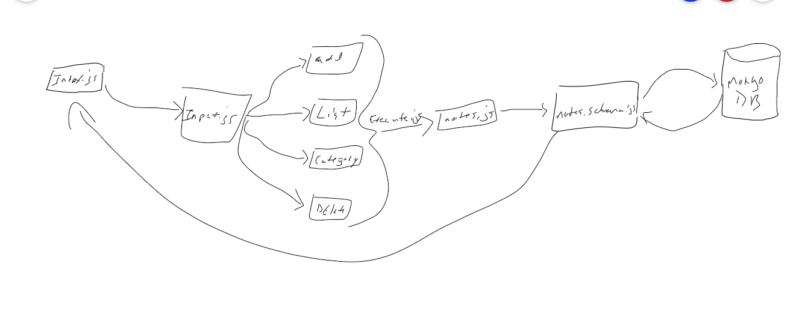

# LAB - Class 01

## Project: Notesy

### Author: Kory Jackson

### Links and Resources

- [Class 01 Submission PR](https://github.com/kory-jackson-401-advanced-javascript/notes/pull/2)
- [Class 02 Submission PR](https://github.com/kory-jackson-401-advanced-javascript/notes/pull/3)
- [Class 03 Submission PR](https://github.com/kory-jackson-401-advanced-javascript/notes/pull/4)
- [github Actions](https://github.com/kory-jackson-401-advanced-javascript/notes/actions)

#### How to initialize/run your application (where applicable)

- Clone Repo down
- From Repo directory run **node index.js --add/-a "Whatever you want as a string"**
- Will return **Adding Note: "Whatever you typed"**
- Error will occur if nothing is filled out for either section.

#### How to use your library (where applicable)

#### Tests

None

#### UML

#### Class 03 UML

